# Mental Health in Context 
 
### Effect Heterogeneity and Mechanism in the Relationship between Neighborhood Disadvantage and Adolescent Depression and Anxiety
 
 
 
### Kara Rudolph

Note: thank you, tom for that kind introduction and 
thanks to you all for coming today. 
my name is kara rudolph ;and i'm going to be talking about my dissertation which is titled [read]

---

## Agenda
 

1. Motivation
2. Dissertation overview
3. Presentation of results
4. Discussion

---
## Motivation: Anxiety and Depression
 

<small> National Comorbidity Survey Replication Adolescent Supplment (NCS-A). Merikangas et al., 2010 </small>

Note: My research so far has been motivated by the goal of working to improve the MH of teens in disadvantaged neighborhoods. 
This graph is from a US nationally representative ...dataset that I used for this dissertation. 
IT shows the cumulative prevelance of different categories of disorders by age. 
For this talk, I'm going to be focusing on adolescent depression (comprises most of what's shown in green) and anxiety (which is shown in red)
nearly 12% of adolescents had ever had major depressive disorder and nearly 32% ever had an  anxiety disorder....

---

## Motivation: Anxiety and Depression
  
Missed school and sociodevelopmental opportunities $\rightarrow$ 
 

* Education
* Employment
* Earnings
* Family life

Note: These disorders are not typically isolated, time-limited events, but can have consequence that extend over the lifecourse
For example, they cause children and adolescents to Miss school and sociodevelopmental opportunities $\rightarrow$ which studies have shown negatively affects educational achievement (Breslau et al., 2008), 
future employment (Kessler et al., 2006), 
earnings (Kessler et al., 2008), 
family life (Kessler et al., 1998)

---

## Motivation: Anxiety and Depression
 

* Depression: 500 million disability days/year, cost of 36B
* Anxiety: 700 million disability days/year
* WHO disease burden rankings

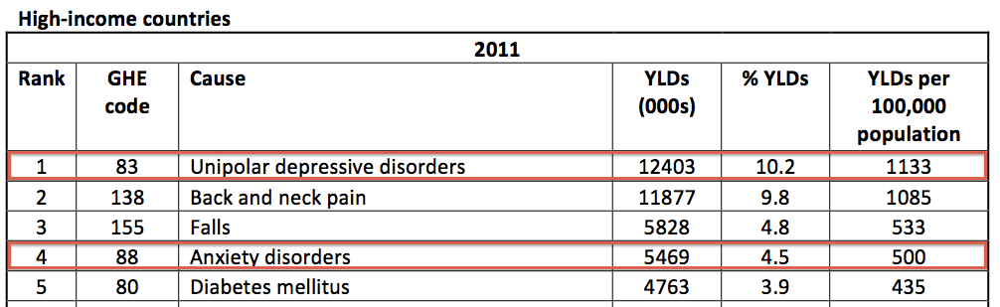

Note: MHdisorders in childhood also Increase risk of disorders in adulthood 
discorders in adulthood have been shown to have signiifcant $\rightarrow$ economic costs
[read]
in fact, depression and anxiety are the leading contributors to years lost to disability in the WHO disease burden rankings

---

## Motivation: Importance of Place

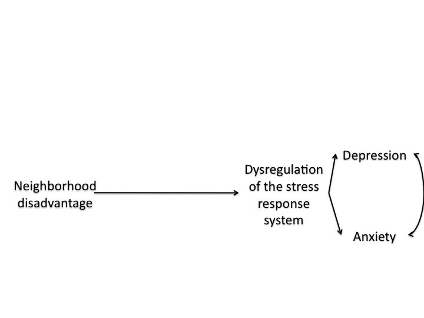

Note: So, it's clear that MH is imporatnat, but why neighborhood? 
well, intuitively, we understand that living in a neighborhood in east bmore may be a different experience than living in a neihgborhood in roland park. 
For example, i taught creative writing to a class of public HS students in DC for a year. theyhad to deal wiht violence on a fairly regular basi-- one of their classmates was tragically even shot and killed. its hard to imagine a classroom of kids from one of the surrounding wealthy suburbs having a similar experience. 
so living in a disadvantaged neighborhood is thought to entail exposure to more sources stress--e.g., violence, lack of opportunity for work and for education, low-collective efficacy--that act to dysregulate the stress response system within individuals. 
dysregulation of the stress response system has been linked to depression and anxiety disorders

---

## Motivation: Research Gaps
 

* Inconsistent results in the literature

Note: There has been a lot of research into the relationship between neighborhood factors like disdavatnage and mental disorders--- in the past 10 years in particular--but results have been inocnsistent. 
I think some of these inconsistencies could be due to methodologic limitations that threaten inference

---

## Motivation: Research Gaps
 

* Inconsistent results in the literature
  * Confounding (neighborhood assignment not random)

Note: 
1. [read] 

---

## Motivation: Research Gaps
 

* Inconsistent results in the literature
  * Confounding (neighborhood assignment not random)
  * Positivity violations (economic and racial segregation of neighborhoods)

Note: 
2. positivity violations, which means that for a particular set of covariate values, assignment of neighborhood is completely defined--there is no randonmess. I'll get into this more later, but one example of where this can come about in neihgborhood research is due to the economic and racial segregation of neihgborhoods in this country. For example... 

---

## Motivation: Research Gaps
 

* Inconsistent results in the literature
  * Confounding (neighborhood assignment not random)
  * Positivity violations (economic and racial segregation of neighborhoods)
  * Lack of generalizability (neighborhood studies are typically conducted among a particular sub-population)

Note: 
3. Lack of generalizability. means that results estimated in some study samples may not be valid for other samples or target populations. [read]
In this dissertation, we addressed each of these--as least in part

---

## Dissertation Overview
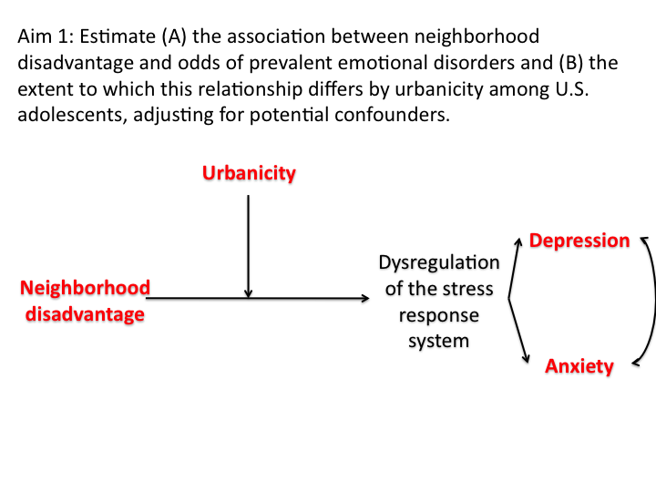

Note: Here is the simplified dag from earlier. 
In aim 1, we looked at the relationship between ND and prevalent D and A and assessed the extent to which level of urbanicity may modify this effect.

---

## Dissertation Overview
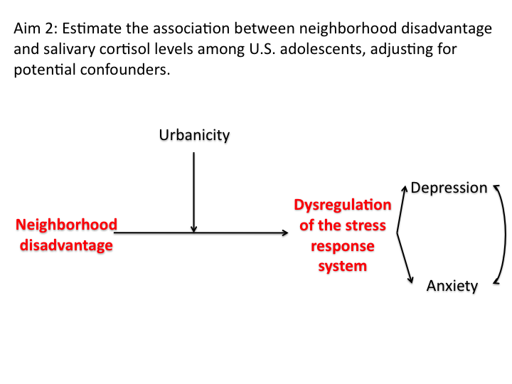

Note:If there is a relationship between ND and D and A, it's been hypothesized to operate through dysregulation of the stress response system. 
So in Aim 2 we move slightly upstream and estimated the assocation between ND and 1 component of the stress response syste, salivary cortisol levels

---

## Dissertation Overview
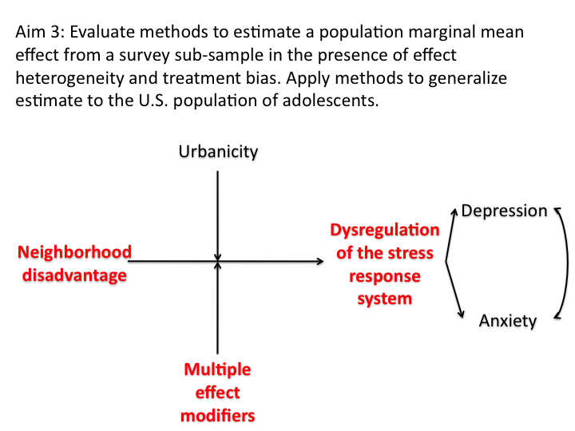

Note: In aim 3, we address a problem from Aim 2--that is that we were only able to estimate the association between ND and cortisol among the subsample of participatns for whom we had cortisl data for.
however, what we really care about is getting an idea for what the association may be in the US population of adolescents. Now, the association may not be the same if there are multiple effect modifiers which also influence selection into the sub-sample. Broadly, the goal here is to generalize a treatment effect from a survey subsample. 
we evaluate a few ways to do this in Aim 3

---

## NCS-A
 

* Nationally representative, cross-sectional sample of U.S. adolescents 13-17 years old (N=10,123)
* Sources of information relevant to this dissertation:
  * Face-to-face, computer-assisted interviews with the adolescent. 
    * Composite International Diagnostic Interview (CIDI) modified for adolescents.
  * Saliva collected before and after each interview.
  * Self-administered questionnaire to parents or parent surrogate of the adolescent.
  * Geocoded residence.

Note: For this dissertation, we use data from the NCSA.
read first bullet
The NCS-A collects information from a variety of sources, but i'll just go through the sources that are relevant to this disseration
read through
CIDI = Composite international diagnostic interview, corresponds to DSM-IV and ICD-9 diagnoses.
saliva was collected before and after each interview for the cortisol samples. 

---

## Aim 1
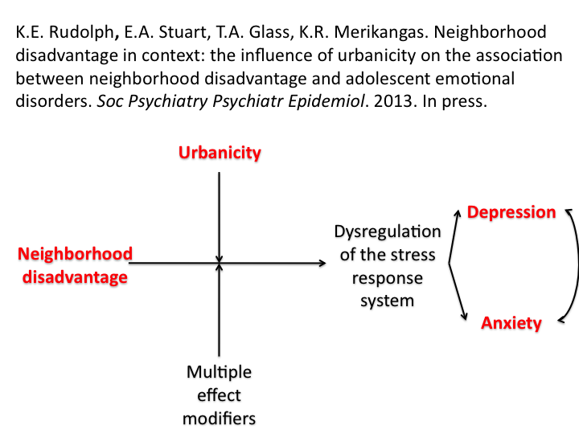

Note: Again, in Aim 1 we examined the pieces that are highlighted in red. 
We looked at the association between ND and prevalent D and A and assessed possibile effect modification by urbanicity. 

---

## Aim 1: Background
 
### Gaps

* Inconsistent results 
* Hypothesis: effect modification by urbanicity may contribute to inconsistent results.

Note: This aim was motivated by the 
Inconsistent results I found when reviewing the literature on the relationship between neighborhood disadvantage-adolescent D and A. 
1. I noticed that Studies... 
2. This may be because living in a disadvantaged neighborhood in an urban area entails exposure to a diffrent set of stressors... for ex, violence, lack of green space, crowding that have also been assoc with higher risk of dep/anx
3. so our hypothesis was that urbanicity may be an effect modifier. specifically, that The association between neighborhood disadvantage and adolescent depression/anxiety may be greater in urban versus non-urban neighborhoods.

---

## Aim 1: Background
 
### Study  

* NCS-A well-suited to evaluate this question. 
  * Nationally representative survey of U.S. adolescent mental health (DSM-IV mental health diagnoses)
  * Geocoded residences, samples include mix of urban, suburban, and rural.  

 

Note: I thought that the NCSA was particularly well-suited to evaluate this question. 
Because of the sampling scheme, it draws adolescents from neighborhoods across a range of urbanicities. 
In addition, addresses are geocoded to CTs, so we can obtain contextual information from Census data.

The definition of mental disorders is partciularly strong, because the instrument that was used--the CIDI--maps on to DSM-IV diagnoses.

---

## Aim 1: Analysis
 

<ul>
<li> Multiple imputation by chained equations </li>
<li> Propensity score subclassification, excluding those without similar counterparts (4.7%)  </li>
<li> Survey design-based, weighted analysis </li></ul>

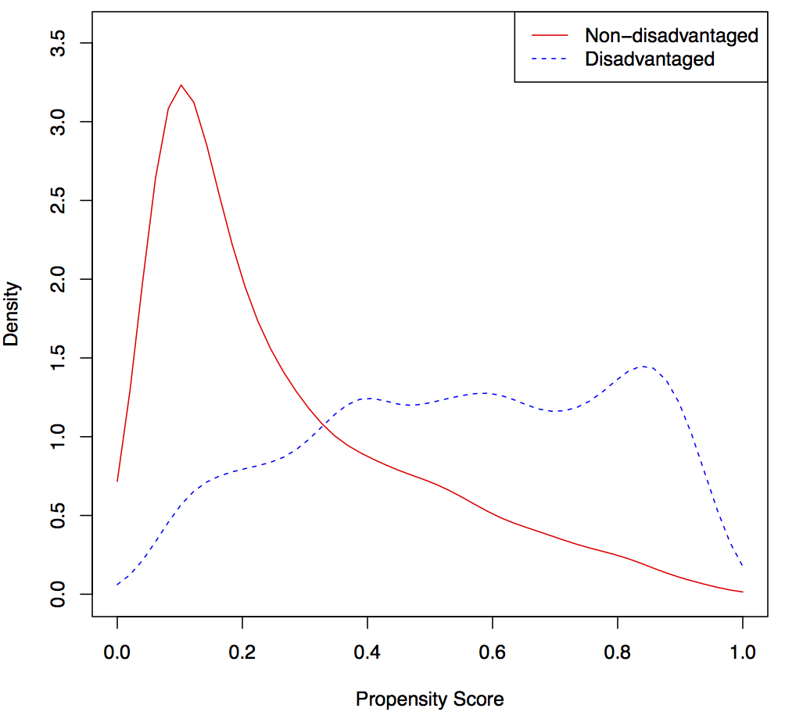

Note: Here is an outline of our analysis approach. [first 2 bullets] 

That's what I'm showing in the figure on the right. 

describe fig 

Say what PS is

by excluding those without similar counterparts, we are essentially chopping off the tails. s
such that for a given propensity score, there are participants in both categories of neihgborhood. meaning that for a given propensity socre, there is some randomness in neighborhood assingment.

---

## Aim 1: Analysis
 

<ul>
<li> Multiple imputation by chained equations </li>
<li> Propensity score subclassification, excluding those without similar counterparts (4.7%)  </li>
<li> Survey design-based, weighted analysis </li></ul>

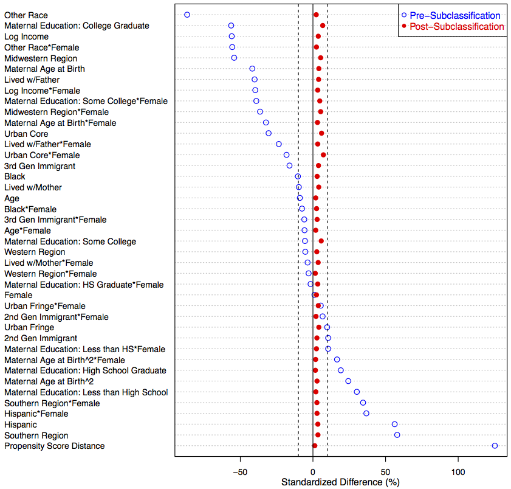

Note:  * PS subclassification also addresses Addresses confounding stemming from non-random assignment of neighborhood residence. I'm showing a one-dimensional summary of how well this worked on teh right. blue dots are pre-subclass.red dots are post-subclas.all of our potential confounding variables are on the y axis and the standaridized mean difference is on the x axis. 
 so this is showing how balanced the two neighborhood groups are for each of the confounding variables. We can see by the blue dots that before PS subclassification, many of the variables were imbalanced. Afterwards, though, the red dots show us that the subclassification was successful in balancing these variables. 
* Within each of the PS subclasses, for each imputed dataset, we then conducted Survey design-based, weighted analysis to maintain the national representativeness of the sample.  

---

## Aim 1: Results

Log odds ratios of prevalent depression or anxiety in disadvantaged versus non-disadvantaged neighborhoods. 

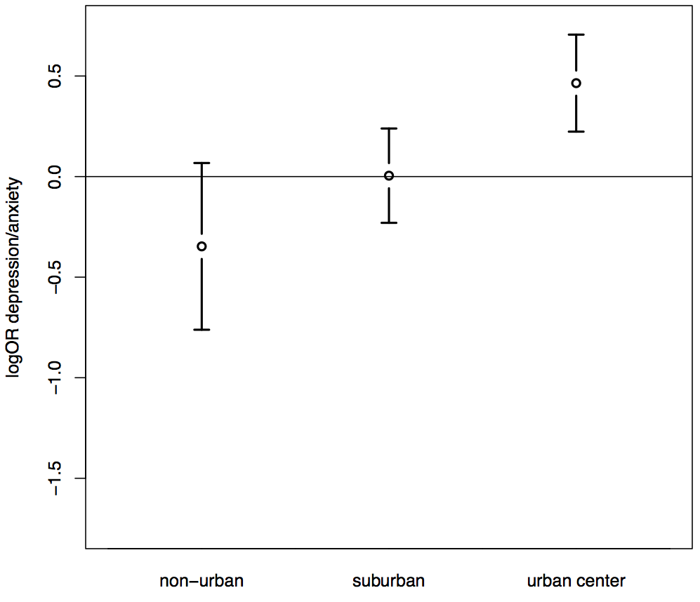

Note: here are our results from Aim 1.
y axis shows the log odds ratio of having prevalent Dep or Anxiety comparing adolescents living in Dis Neigh to nonDis neihg. 
x axis estimates this log OR for each the 3 urbanicities: non-urban, urban fringe and urban center.

see a dose response relationship where the log OR increases by level of urbanicity.

---

## Aim 1: Results

Log odds ratios of prevalent depression or anxiety in disadvantaged versus non-disadvantaged neighborhoods. 

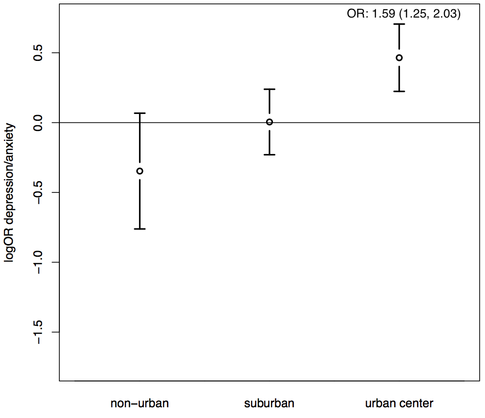

Note: for adolescents in urban centers, living in a disadvantaged neighborhood is associated with have 59% (1.25, 2.03) greater odds of having a prevalent anxiety/depression as compared to living in a non-disadvantaged neighborhood

---

## Aim 1: Results

Log odds ratios of prevalent depression or anxiety in disadvantaged versus non-disadvantaged neighborhoods. 

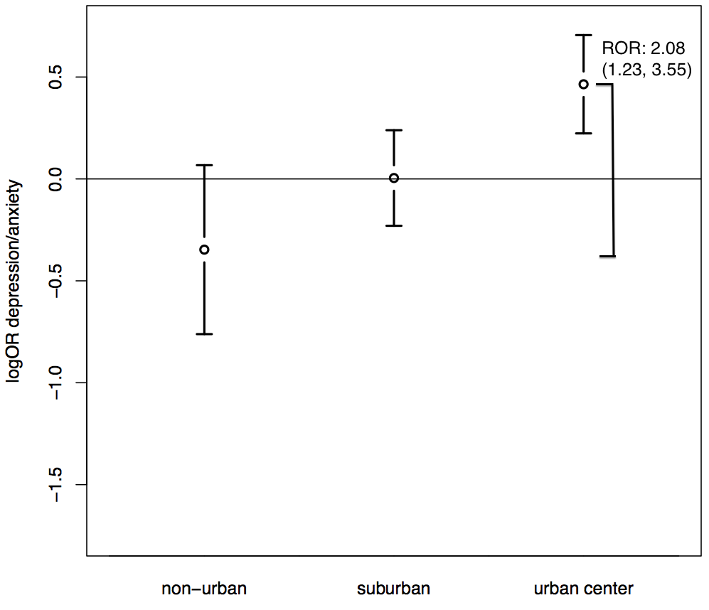

Note: the interaction between urban center and neighborhood dis is also significant. 
Specifically, the association between neighborhood disadvantage and prevalent anxiety/depression is more than twice as large (ratio of odds ratios: 2.08, 95% CI: 1.23, 3.55) for adolescents living in urban centers versus non-urban areas

---

## Aim 2
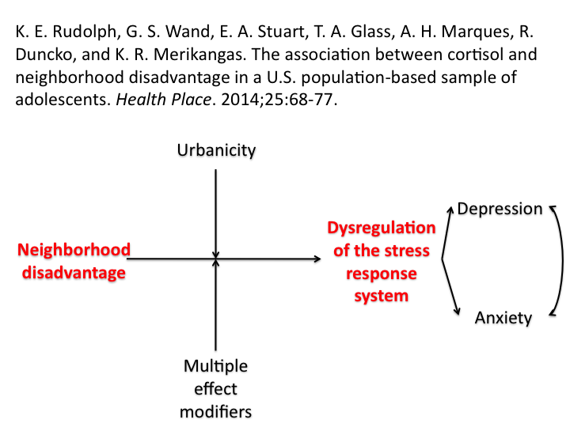
Note:  slow down
As a reminder, in Aim 2 we examined the components of our conceptual model that are highlighed in red. We moved upsteam and estimated the association between ND and one aspect of the stress response system: salivary cortisol. 

---

## Aim 2: Background
 
### Gaps
* Few studies
* Small sample size
* Racial/ethnic homogeneity
* Geographic homogeneity

Note: In Examining the association between ND and cortisol, we were motivated by several gaps in the literature. 
* First, there has been surprisingly little research into this realtionship in adolescets. In fact, in my literature review, I only found 3 studies. 

* However, each of thes 3 studies were Limited by small sample size and racial/ethnic and geographic homogeneity.
for example the biggest study only included 163 teens (163, 100, 79)
2/3 studiies were only of african americans
and all 3 of the studies only sampled from single urban areas (flint, St Louis, Philadelphia)

---

## Aim 2: Background
 
### Study

* Largest sample to date (2,490 have cortisol measurements).
* Racially and ethnically diverse. 
* Participants drawn from different regions of the U.S., urbanicities. 
Note:  Again, I thought the NCS-A was well-suited to address these gaps.
[read]

---

## Aim 2: Background
 

Relationship between neighborhood sources of stress and cortisol levels is complex
<ul>
<li> Hypothalamic-pituitary-adrenal (HPA) axis dimension  </li>
<li> Blunting</li>
<li> Time of day</li>
</ul>

<small>(Do et al., 2011.)</small>

Note: Before I get into the specifics of our analysis, I want to convey that the stress response system is extremely complex, and so Examining the relationship between neighborhood sources of stress and cortisol involves requires stratgies to manage this complexity. 

1. numerous systems involved in stress response. cortisol is a component of one of these systems called the ...
The relationship  between ND and cortisol likely depends on the dimension measured. the two (1) resting, unprovoked levels and (2) and reactivity to an acute stressor

2. Seoncd, the relationship between ND and cortisol also likely depense on the History of exposure to stress. With moderate amounts of stress, resting cortisol levels increase and reactivity also increases. But among those who have been exposed to really severe and persistant stress---children who are abused---the cortisol levels and reactivity actually are blunted---look more similar to unstressed children.This is called blunting, because the idea is that after repeated or prolonged activation of the stress response system, this response wears out. 

3. time of day. Graph: diurnal rhythm. explain CAR.

and the relationship between enighborhood sources of stress may differ depending on time of day. explain graph 

---

## Aim 2: Analysis
 
Challenge | Approach
--------- | --------
Not at-risk for a cortisol response | Restrictive exclusion criteria
Blunting | Sensitivity analysis
Heterogeneity by CAR/ post-CAR | Restricted to post-CAR
Diurnal rhythm | Propensity score matching with Mahalanobis matching 
Other strong predictors | Propensity score matching with exact matching

Note: given this complexity, cortisol is ideally measured under very strict laboratory protocols, but this isn't practical in a large, nationally representative sample like the NCSA
In the NCSA, cortisol was measured in the adolescents home right before the start of the interview and right after. 
we were left with the challenge: How to construct a controlled analysis?

when say blunting talk about possible washout effect

---

## Aim 2: Analysis
 
### Cortisol outcomes
* Pre-interview
* Post-interview
* Slope over the course of the interview

Note: There were 3 cortisol outcomes that we examined in this analysis. [read the 3] These don't correspond to specific HPA axis dimensions, since cortisol wasn't measured under controlled conditions with standardized protocols, so I'm going to take a second to describe what these outcomes may reflect. 

Preinterview sample taken right before the interview. likely reflect any activity the adolescent was engaged in prior to the interview, foods, as well as anticipation of the new situation of being interviewred in her home by a researcher for ta survey on mental health. Something out of the ordinary! And relevant, because the HPA access is particularly sensitive to novelty.

Postinterview sample right after the interview. The interview was specifically designed not to be stressful, so adoelscents probably became pretty bored over the course of the interview. The post-interview levels may relfect that as well as the fact that now the adolescent has been sitting down for 2 and a half hours. 

We also looked at slope over the course of the interview-- post - pre/ interview time. this can be thought of as a measure of recovery from this novel interview situation.

---

## Aim 2: Analysis

 
<ul>
<li> Multiple imputation by chained equations </li>
<li> Regression outcome analyses on matched, imputed datasets </li>
<ul><li>  Gamma regression for point-in-time measures</li>
<li>  Linear regression for cortisol rate</li></ul>
</ul>

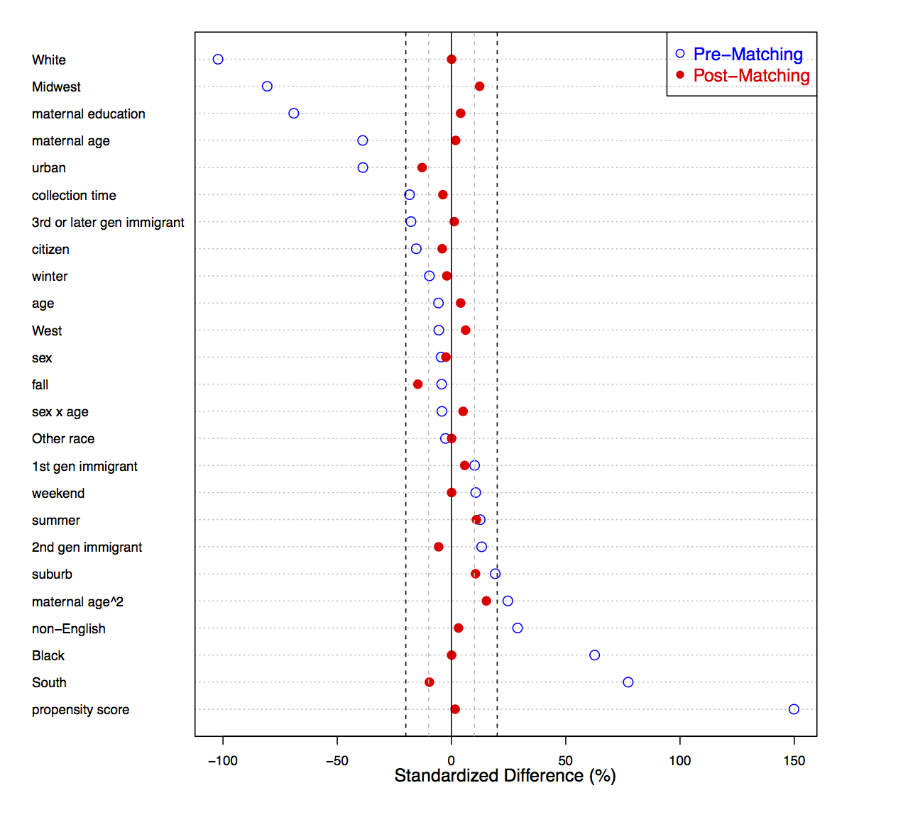

Note: Here again is an outline of our analysis approach. 
[MICE]

* We then performed PS matching with replacement combined with matching on the subset of especially important cortisol predictors as described on the previous slide. [describe figure]

*Then, we performed regression outcome analyses on the [read]
This approach can be thought of as being double robust, because the potential confounders are included in both the PS model and outcome model. so if one model is incorrectly specified but the other is correctly specified, we should still get a consistent estimate

---

## Aim 2: Results
 
Conditional expected ratios of cortisol levels (left) and   conditional expected differences in cortisol slope (right)   comparing those in disadvantaged versus non-disadvantaged neighborhoods. 

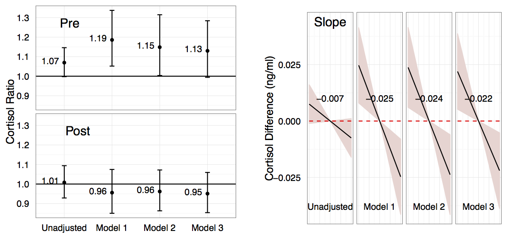

---

## Aim 2: Results
 
Conditional expected ratios of cortisol levels (left) and   conditional expected differences in cortisol slope (right)   comparing those in disadvantaged versus non-disadvantaged neighborhoods.

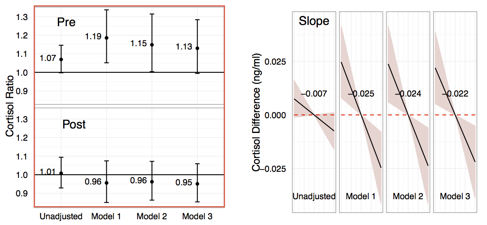

Note: Left panel showing conditional expected ratios of cortisol levels comparing adolescents in disadvantaged neighborhoods to those in non-disadvatnaged neighborhoods. Point estimates and 95% CI

---

## Aim 2: Results
 
Conditional expected ratios of cortisol levels (left) and   conditional expected differences in cortisol slope (right)   comparing those in disadvantaged versus non-disadvantaged neighborhoods. 

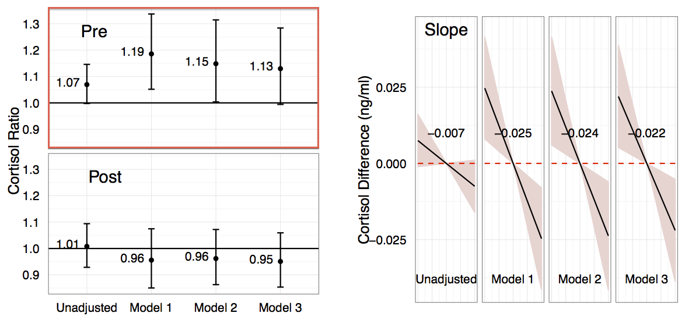

Note:
Top panel is for the pre-interview cortisol levels and 

---

## Aim 2: Results
 
Conditional expected ratios of cortisol levels (left) and   conditional expected differences in cortisol slope (right)   comparing those in disadvantaged versus non-disadvantaged neighborhoods. 

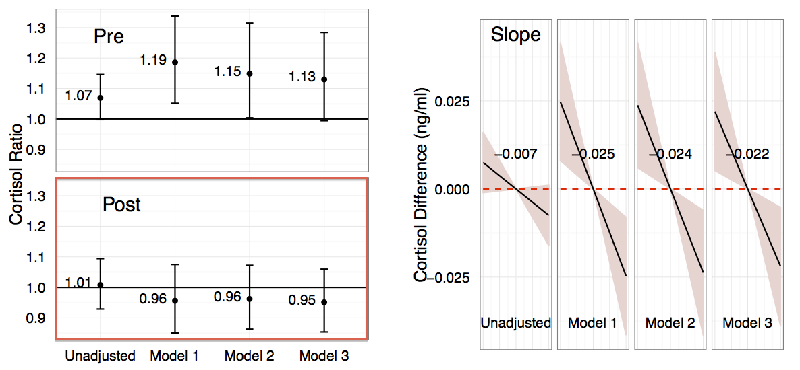

Note:and bottom Panel is for the post-interview cortisol levels.

---

## Aim 2: Results
 
Conditional expected ratios of cortisol levels (left) and   conditional expected differences in cortisol slope (right)   comparing those in disadvantaged versus non-disadvantaged neighborhoods. 

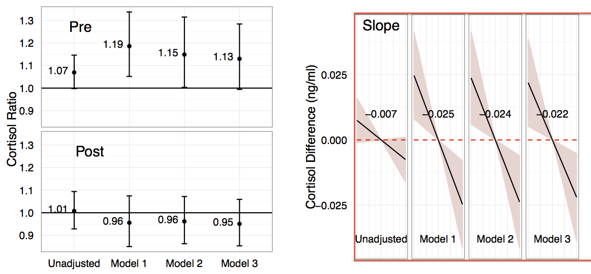

Note:
Right shows the conditional expected diffrences in cortisol slope  comparing adolescents living in disadvantaged versus non-disadvantaged neighborhoods.
Again, we show the estimate and 95% CI

---

## Aim 2: Results
 
Conditional expected ratios of cortisol levels (left) and   conditional expected differences in cortisol slope (right)   comparing those in disadvantaged versus non-disadvantaged neighborhoods. 

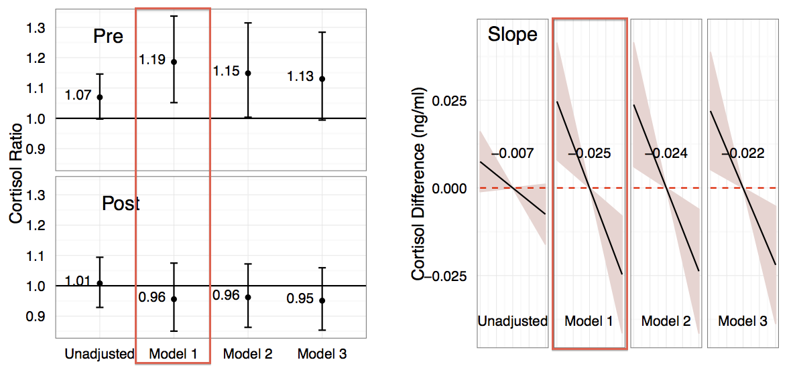

Note: In each of the three panels, we show the results for the unadjusted and 3 adjusted models. 
Adjusted Mdoel 1 adjusted for possible confounders listed in the previous figure in both propesntiy score matching and regression. BEcause of the definition of confounder, these were variables that we thought would not be affected by the exposure. So for example, gender, age, race, season, region of the country, immigrant status, etc. 

---

## Aim 2: Results
 
Conditional expected ratios of cortisol levels (left) and   conditional expected differences in cortisol slope (right)   comparing those in disadvantaged versus non-disadvantaged neighborhoods. 

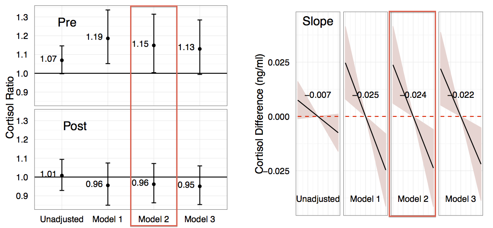

Note: Adjusted model 2 added variables for which there could be debate about whether they could be affected by the exposure. So, they could be confounders and mediators. These were family income and employment history and current status.

---

## Aim 2: Results
 
Conditional expected ratios of cortisol levels (left) and   conditional expected differences in cortisol slope (right)   comparing those in disadvantaged versus non-disadvantaged neighborhoods. 

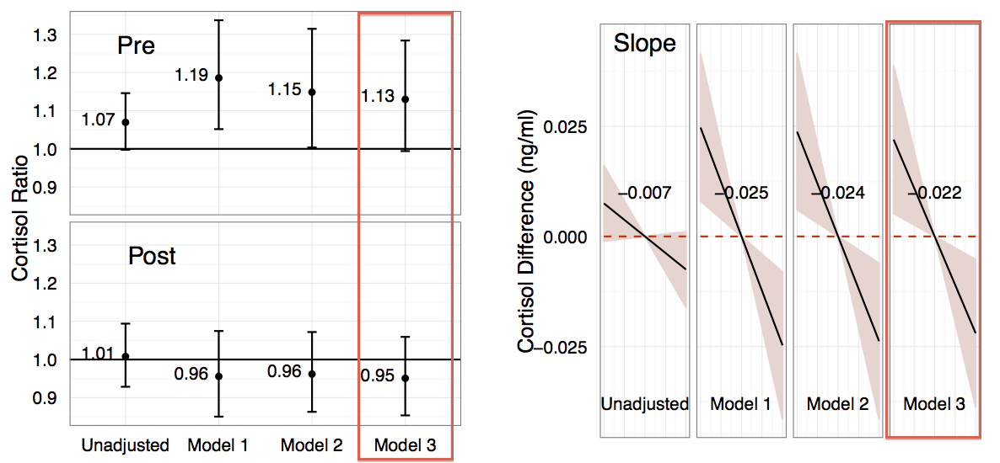

Note: Adjusted model 3 added hypothesized mediators: small for gestational age, BMI, and sleep variables like typical bedtime on weekdays, bedtime on weekends, typical hours slept on weeknights and typical hours slept on weekends. I should note that the effects across the adjusted models are not directly comparable be/c here, we are just left with the direct effect.

---

## Aim 2: Results
 
Conditional expected ratios of cortisol levels (left) and   conditional expected differences in cortisol slope (right)   comparing those in disadvantaged versus non-disadvantaged neighborhoods. 

Note: So in all the models, we see that adolescents in disadvantaged neighborhoods have slightly higher cortisol levels prior to the interview than those in disadvantaged neighborhoods. 
We see that there's no real difference in post-interview levels. 
Adolescents in disadvantaged neighbrohoods have slighly steeper cortisol rates of decline over the course of the interview than those in non-disadvantaged nieghborhodos. 
We interpreted these results as possibly reflecting heightened reactivity to and recovery from the novel stimulus of the interview. 

---

## Aim 3: Background
 

Problem raised in Aim 2: 

* Want to generalize association estimated in sub-sample to U.S. adolescents 
* May not generalize if:
  1. effect heterogeneity and 
  2. sub-sample selection probabilities depend on effect modifiers

Note: Problem raised in Aim 2: 
* Want to estimate the association between living in a disadvantaged neighborhood and cortisol slope among U.S. adolescents, but only have cortisol data on a sub-sample of this nationally representative sample. 
* Estimated associations may be different from those estimated in the complete sample if there is:
  1. effect heterogeneity and 
  2. sub-sample selection probabilities depend on effect modifiers

Broadly, problem of generalizing results from a survey subsample

---

## Aim 3: Background
 

Need to control for: 

* Non-random assignment of families into neighborhoods 
* Non-random selection into survey
* Non-random selection into the cortisol sample

Note: To get an idea of what the association would be among the population of U.S. adolescents, we need to 
[read]

---

## Aim 3 

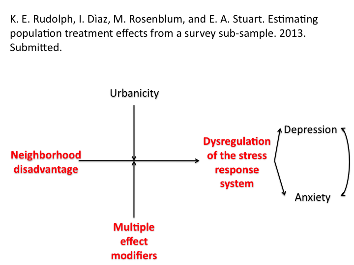

Note: slow down
Here I;m showing which part of our conceptual frame work we're addressing in red. 

---

## Aim 3: Analysis
 

### Simulation study
* Estimand: population average treatment effect (PATE)

Note: Aim 3 consisted of a simulation study, which we then applied to our motivating example from Aim 2.
Our goal was to estimate a population average treatment effect, $E(Y_1 - Y_0)$, from survey sub-sample. 
In terms of our motivating example: this would be to estimate the average effect of living in a disdavantaged neighborhood on cortisol slope for U.S. adolescents. 

---

## Aim 3: Analysis
 

### Simulation study
* Estimand: population average treatment effect (PATE)
* Estimators
  * Inverse probability weighting (IPW) 

 

$$w^{A=a, \Delta\_{svy}=1, \Delta\_{sub}=1} = \frac{I(A=a, \Delta\_{sub}=1, \Delta\_{svy}=1)}{P(A=a,\Delta\_{sub}=1, \Delta\_{svy}=1 \vert \mathbf{W})}$$

$$E(Y\_1 - Y\_0) = \frac{1}{\sum\limits^r\_{i=1}w\_i^{A=a, \Delta\_{svy=1}, \Delta\_{sub}=1}}\sum\limits^r\_{i=1}w\_i(2A\_i-1)Y\_i$$

Note: 
When I initially came across this issue, I thought I'd just use inverse probability weights. In terms of the Aim 2 exampls, This approach would involve weighting each adolescent by her predicted probability of living in a disadvantaged neighborhood as a fxn of covariates and being selected into the NCS-A and sub-sample with cortisol measures as a fxn of covariates. Then, we would subtract the weighted average cortisol slope for those who did not recieve treatment from the weighted average cortisol level for those who did receive treatment. If these tx and sel models are correctly specified, then this approach will adjust for all 3 sources of non-randomness.
However, in this scenario, that approach would involve multiplying 3 weights--(1) survey weights, (2) inverse probability of selection in the sub-sample weights, and (3) inverse probability of treatment weights. IPW already have efficiency concerns, and we were worried that they might get unweildy. So we wanted to compare IPW to some other options that might perform as well or better but would be similarly simple to implement.

---

## Aim 3: Analysis
 

### Simulation study
* Estimand: population average treatment effect (PATE)
* Estimators
  * Inverse probability weighting (IPW)
  * Double robust weighted least squares (DRWLS)
  * Targeted maximum likelihood estimation (TMLE)

Note: we Compared 3 estimators.  We compared IPW, to two estimators that haven't been as widely disseminated: Joffe's DRWLS, and van der Laan's TMLE. 
DRWLS and TMLE have been compared with IPW previously, but typically in the scenario where there is one source of non-randomness (for example, nonrandom treatment assignment or non-random sample selection or missing data). We wanted to specifically look at the relative performace in this scenario where there is (1) nonrandom subsample selection from a (2) survey with weights, (3) non-random treatment assignment and (4) treatment effect heterogeneity on the outcome. In doing this, we also demonstrated how to impelment TMLE in the context of survey weights. 
(both DRWLS and TMLE are both DR estimators. In this case, being double robust means that any one of our 3 models (tx, outcome, selection into the subsample) can be incorrect and we can still get a consistent estimate. We need to survey weights to be correct though. 

---

## Aim 3: Analysis
 
### Simulation study

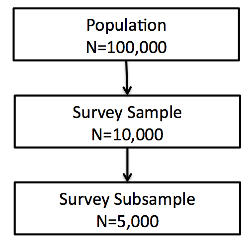

Note: This figure depicts the setup of our simulation. We start with a population of 100,000 individuals, there is a selection mechanism that selects 10,000 of these into a survey--similar to the NCSA. 
There is then another selection mechanism that selects 5,000 of the survey participants into the subsample. kind of like in the NCSA data where a few thousand of the NCSA participants had cortisol data measured. 

---

## Aim 3: Analysis
 
### Simulation study

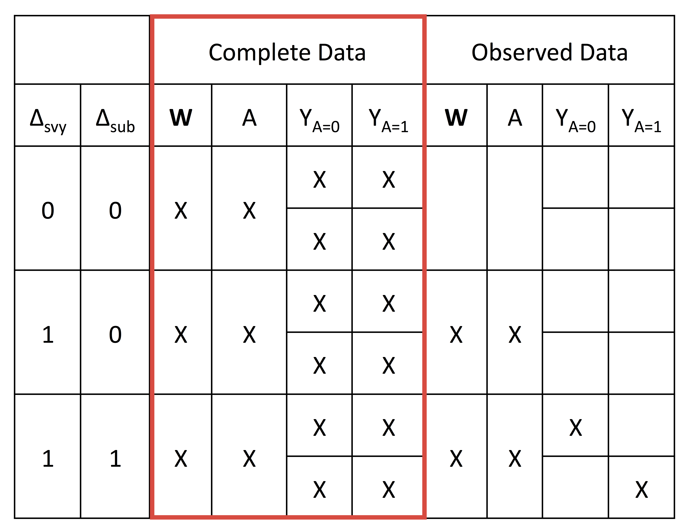

Note: The nice part about using simulation, is that we can see the full data for everyone in the population. so we see everyone's vector of covariates, W, treatment assignment, A, and potential outcomes Y under treatment A=1 and no treatment A=0. 
So, we know the true PATE in this simulation. 

---

## Aim 3: Analysis
 
### Simulation study

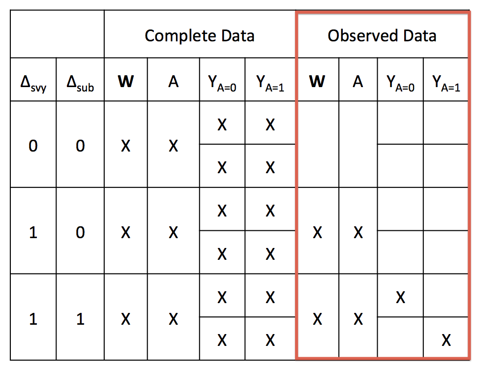

Note: In the observed data, however, we observe no data for individuals not in the survey. 
For those in the survey but not in the subsample, we see their covariates and treatment.
For those in teh subsample, we see covariates, treatment and the potential outcome for the treatment they actually received. 

Go through example of the bottom lines.

---

## Aim 3: Results

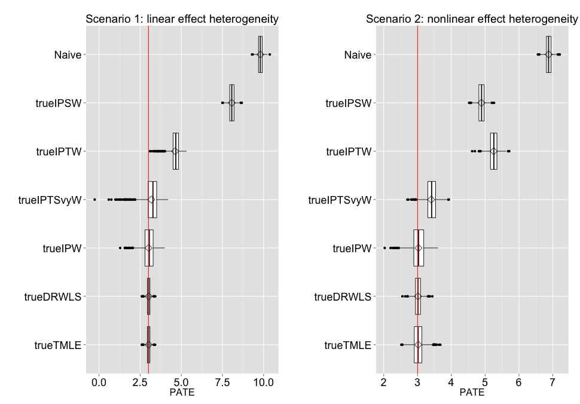

Note: In this simulation, we considered two different scenarios. Scenario 1 had linear EH and is shown on the left. Scenario 2 had non-linear EH. and is shown on the right.
what we're showing on the x-axis are the PATE estimates over the 1,000 simulations when we correctly specified the all parametric models. 
there is a red line at the true value, which is 3 in both scenarios
The estimators are on the y axis. Show the importance of adjusting for all 3 sources of non-randomness: 
selection into survey, selection into subsample, non-random treatment assignment.

Top estimators adjust for 0, 1, or 2 of the soures. Bottom 3 estimators adjust for all 3.
Review each
Naive estimator does not adjust for anything. It is just the average outcome among the treated minus the average outcome among the non-treated.

IPW, DRWLS and TMLE all  acoun for nonrandom treatment and both selection mechanisms
We see that each of these methods provides a consistent estimate 

---

## Aim 3: Results

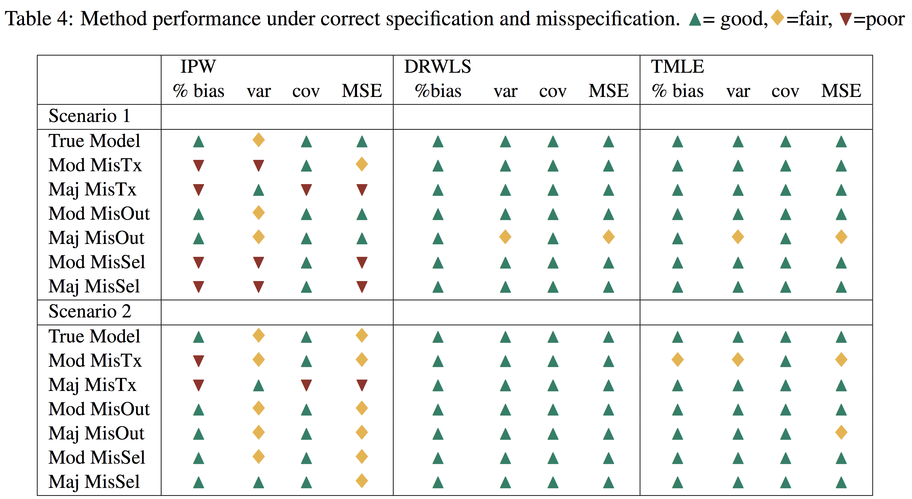

Note: This table summaries the meat of our results. as i showed before, we evaluated each estimator under the two different scenarios. 
we did this when when correctly specified the parametric models as i showed before, but also under various misspecifications. Describe mod/maj

We misspecify each of the treatment, selection, and outcome models. 
Review what each model is. 
Tx model is the model predicting residence in a disadvantaged neighborhood as a function of covariates. For example, a logistic regression model.
Selection is the model predicting selection into the sub-sample of those with cortisol measures as a fxn of covariates. For example, another logistic regression model.
Outcome is the model predicting cortisol slope as function of covariates, treatment and interaction between between treatment and effect modifiers. For example, a linear regression model.

We see that in general both DRWLS and TMLE perform well when any one of the models is misspecified.
This is not all that surprising, given that these two methods are double  robust, but what was surprising to me was the poorer performance of IPW even when all the models were correctly specificied.
IPW continues to be widely used--I think possibly because it is easy to implement in any software. By showing how TMLE can be implemented wiht survey weights and by providing a tutorial for both TMLE and DRWLS, we hope that these better-performing methods may gain popularity.

---

## Aim 3: Results
 

Apply methods to Aim 2

* Living in a disadvantaged neighborhood associated with steeper decline of cortisol slope: 95%CI: -7.36, -0.04x10-2 ng/mL/hour

Note: Following the simulation, we applied the 3 methods to our research question from Aim 2: to what extent does living in a disadvantaged neighborhood influence cortisol slope over the course of the interview? In this case the methods resulted in similar estimates, which was also similar to what we estimated in Aim 2. 

---

## Dissertation Conclusions
 

* Link between neighborhood and mental health among adolescents.
  * Disadvantaged neighborhood associated with $\uparrow$ odds of depression/anxiety if urban center 
  * Disadvantaged neighborhood associated with cortisol levels
* Estimating effects/associations from a survey sub-sample
  * DRWLS and TMLE vs. IPW

Note: I'd like to wrap up with some overall conclusions from this work
In this dissertation, we find further support...[read]
* Further support for the link between neighborhood and mental health. 
  * Living in a disadvantaged neighborhood associated with $\uparrow$ odds of depression/anxiety if that neighborhood is in an urban center but not otherwise.
  * Living in a disadvantaged neighborhood associated with cortisol levels. In sub-sample and for U.S. adolescents.
  
We also evaluate methods to estimate effects/ associations [read]
specifically, we recommend two DR methods as opposed to IPW. These methods are similar to IPW in terms of their straightforward implementation, but because they are double robust, they perform much better than IPW under incorrect specification of one of the treatment or selection models.

---

## Dissertation Conclusions
 

### Broad applications
  * Targeting interventions to those subpopulations who may benefit most
  * Facilitate generalizability of findings 

Note: Broad applications stemming from these conlcusions include:

---

## Limitations
 

* Neighborhood disadvantage as exposure
  * Measurement limitations

Note: Before ending, I'd like to review a few of the dissertation's limiations and strengths.
For example, there are a number of limitations that stem from using neighborhood disadvantage as the exposure of interest
first, ND is measured with error 
this is because
1. this is a latent variable and we are using a summary measure as a proxy
2. CTs are not neighborhoods

---

## Limitations
 

* Neighborhood disadvantage as exposure
  * Measurement limitations
  * Theoretical limitations
  

Note: second, there's the theoretical limiation that
1. neighborhood disadvantage does not mean the same thing for everyone. 
for one adolescent, living in a disadvantaged neighborhood may mean being exposed to multiple sources of neighborhood violence , loud noise from traffc, and interacting with schoolmates who are relatively homogenous in their socioeconomic makeup. For another adolescent, living in a disadvantaged neighborhood may mean being exposed to violence witness- ing, but not victimization, minimal noise, and interacting with schoolmates who have a relatively diverse socioeconomic makeup. In our analyses, both of these adolescents would be classified as living in disadvantaged neighborhoods. 

I think this is fairly significant limitation, and In future work, I would like to focus on studies with well-defined and potentially modifiable treatments/exposures. 
would aid inference as well as the study’s practical utility informing policies and programs. 

---

## Limitations
 

* Neighborhood disadvantage as exposure
  * Measurement limitations
  * Theoretical limitations
* Cortisol as outcome
  * Measurement limitations
  

Note: cortisol is sensitivite to a wide range of factors that are typically held constant in when cortisol is measured under laboratory conditions, but were not able to be held constant in its collection in this case. 
the study did not use protocols that correspond to one of the HPA axis domains. administer either a standardized acute stressor (e.g., a Trier stress test) or rest period are required. we cannot infer that the cortisol outcomes in Aim 2 map onto specific HPA axis dimensions.

---

## Limitations
 

* Neighborhood disadvantage as exposure
  * Measurement limitations
  * Theoretical limitations
* Cortisol as outcome
  * Measurement limitations
  * Theoretical limitations
  

Note: cortisol is only one of many biomarkers of one of many systems involved in stress response. So, we are only observing one tiny piece of this very complex system. 

---

## Strengths
 

* Sample

Note: Sample: large, racial/ethnically and geographically diverse, nationally representative of U.S. adolescents

  * Ability to answer questions about effect modification that previously could not be answered

  * Address generalizability

---

## Strengths
 

* Sample
* Address issues that pose particular challenges in neighborhood studies 
  * Confounding 
  * Structural positivity violations
  * Generalizability
* Facilitate use of double robust methods over IPW

Note: Address issues that pose particular challenges in neighborhood studies: 
  * Confounding due to non-random neighborhood assignment: PS methods, sensitivity analyses for an unobserved confounder
  * Structural positivity violations due to economic and racial segregation: PS methods, limiting to comparable sub-sample
  * Generalizabitiliy. 
* Specifically for Facilitate use of double robust methods over IPW for generalizing effects from a survey sub-sample. in doing so, Demonstrate TMLE implementation in the case of survey weights. 

---

## Acknowledgements
 

* Ph.D. Advisor: Tom Glass 
* M.H.S. Advisor: Liz Stuart
* Dissertation committee: Rosa Crum, Gary Wand
* Dissertation collaborators: Kathleen Merikangas, Bill Eaton, Michael Rosenblum, Iv&agrave;n D&igrave;az
* Funding: Department of Epidemiology, NIMH intramural training fellowship, Sommer Scholarship
* William
* Family: Scott, Lisa and Kurt
* Friends

Note: Thank you all for being here today. I would like to thank a few folks in particular, as this dissertation has been truly a collaboratiave effort. In particular, I would like to thank my advisors, Drs. Tom Glass and Liz Stuart. Tom provided me with encouragement to tackle the issues that inspired me from the beginning. As you all know, he is a careful thinker and a great model for thoroughness in approaching research questions. Liz provided me with innumerable hours of advice in applying causal inference methods. In the process, I discovered that this meld of causal inference and social epidemiology was the research area that most excited me.

I would also like to thank my committee members, Drs. Rosa Crum and Gary Wand, as well as Drs. Kathleen Merikangas, Bill Eaton, Michael Rosenblum, and Iva ́n D ́ıaz for their many conversations and guidance over the years and iterations of this dissertation. 

I’ve been fortunate during my time in the Ph.D. program to be the recipient of several generous funding mechanisms, including an NIMH pre-doctoral training fellowship and Sommer scholarship. These have allowed me to dedicate more attention and time to research and less to worrying about paying the bills. 

Finally, I would like to thank my husband, William, for his support, grocery shopping, and whistling; my parents, Lisa and Kurt Rudolph, and brother Scott Rudolph, for their encouragement; and many friends for their enthusiasm.